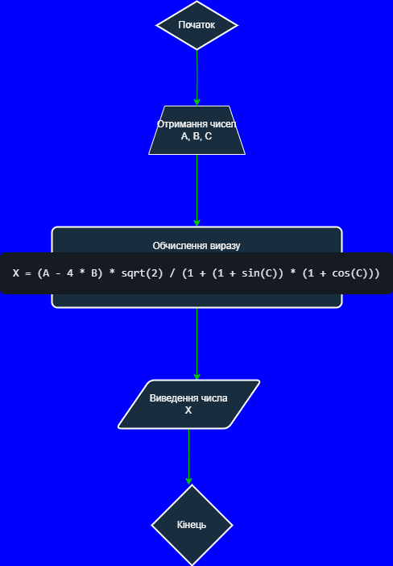
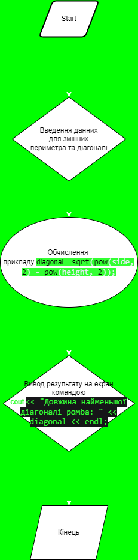

# Лабораторна робота №1

## Мета

- Вивчити особливості використання вбудованих типів даних: char, int, long, short, float, double, unsigned char, unsigned int, unsigned long.
- Вивчити особливості використання функцій введення - виведення.
- Навчитися застосовувати стандартні математичні функції.

## Умови задач

**Завдання 1**
Потрібно обчислити значення виразу: `X = (A - 4 * B) * sqrt(2) / (1 + (1 + sin(C)) * (1 + cos(C)))` та вивести його на екран. Змінні A, B, C, D мають бути введені користувачем через консоль.

**Завдання 2**
Мета другого завдання - написати програму для знаходження меншої діагоналі ромба, якщо значення периметра ромба введене з клавіатури.


## Виконання завдань
**Завдання 1**
Для виконання першого завдання отримуємо з консолі значення змінних A, B, C. Під час обчислень використовуються математичні функції косінуса та сінуса.

**Блок-Схема до завдання 1**:


**Завдання 2**
Для виконання цього завдання нам потрібно було створити 4 змінних: ` perimeter, side, height, diagonal ` . Потім потрібно було для двух змінних `perimeter, height` задати їм значення, а потім перейти до розв'язку(пошуку) найменьшої діагоналі ромба виразом: ` diagonal = sqrt(pow(side, 2) - pow(height, 2));`. В кінці кінців виводимо отриманний результат на екран і завдання готове!

**Блок-Схема до завдання 2:**


## Код программ:
**Перша программа**
```cpp
#include<iostream>
#include<cmath>
#include<conio.h>

using namespace std;

int main() // створюємо головне пространство нашого коду
{
	setlocale(LC_CTYPE, "ukr");  // додаємо можливість програмі читати українські літери
	cout << "Лабораторна робота номер 1, завдання 1, варiант 28" << endl; // вивід повідомлення
	cout << "Студент Старостин Максим Iванович группа IПЗ-12/2" << endl; // вивід повідомлення
	cout << "---------------------Умова завдання---------------------" << endl; // вивід повідомлення
	cout << "За даними, що  введенi з клавiатури в оперативну пам’ять, визначити значення  виразу\n"
		"X = (A - 4 * B) * sqrt(2) / (1 + (1 + sin(C)) * (1 + cos(C))) \n використовуючи математичнi функцiї, і вивести результат на екран.\nДовiльнi значення змiнних A,B,C,D ввести з клавiатури." << endl;
	puts("-----------------------------------------------------------"); // для прикраси
	float A, B, C, X;
	cout << "Введiть довiльнi значення для змiнних" << endl; // просимо користувача ввести
	_cputs("A = "); // вивід змінної на екран для введення значення користувачем
	cin >> A; // Після вводу числа присвоєння цього числа змінній A
	puts("B = "); // вивід змінної на екран для введення значення користувачем
	cin >> B; // Після вводу числа присвоєння цього числа змінній B
	puts("C = "); // вивід змінної на екран для введення значення користувачем
	cin >> C; // Після вводу числа присвоєння цього числа змінній C
	puts("Введеннi вами даннi будуть використанi для розрахунку прикладу програмою!"); // виведення повідомлення на екран
	puts("-------------------------------------------------------------------------"); // для прикраси
	X = (A - 4 * B) * sqrt(2) / (1 + (1 + sin(C)) * (1 + cos(C))); // початок обчисення
	cout << "X = (A - 4 * B) * sqrt(2) / (1 + (1 + sin(C)) * (1 + cos(C)));, result = " << X << endl; // вивiд результату на екран
	system("pause"); // пауза програми до натиску по кнопці
	return 0; 
}
```

**Друга программа**
```cpp
#include <iostream>
#include <cmath>

using namespace std;

int main() {

    setlocale(LC_CTYPE, "ukr");  // додаємо можливість програмі читати українські літери
    cout << "Лабораторна робота номер 1, завдання 2, варiант 25" << endl; // вивід повідомлення
    cout << "Студент Старостин Максим Iванович группа IПЗ-12/2" << endl; // вивід повідомлення
    cout << "---------------------Умова завдання---------------------" << endl; // вивід повідомлення
    cout << "Висота ромба, проведена з вершини тупого кута, ділить сторону навпіл.\n Знайдіть меншу діагональ, якщо значення периметра ромба введене з клавіатури." << endl; // вивід повідомлення з умовою задачі
    cout << "-----------------------------------------------------------" << endl; // для прикраси

    double perimeter, side, height, diagonal; // создаємо змінні

    cout << "Введіть периметр ромба: "; 
    cin >> perimeter; // присвоюємо введене значення змінній периметру

    // вичисляємо довжину сторони ромба (половина периметра)
    side = perimeter / 2.0;

    cout << "Введіть висоту ромба: ";
    cin >> height; // присвоюємо введене значення змінній висоти ромба

    // вичисляємо довжину найменьшої діагоналі
    diagonal = sqrt(pow(side, 2) - pow(height, 2));

    cout << "Довжина найменьшої діагоналі ромба: " << diagonal << endl; 

    return 0;
}
```
