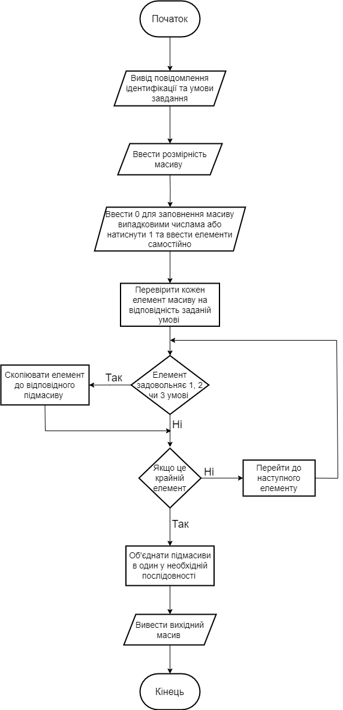

## Мета

- Ознайомитися з особливостями типу масиву;
- Опанувати технологію застосування масивів даних;
- Навчитися розробляти алгоритми та програми із застосуванням одновимірних масивів

## Умови задач

**Завдання 1:** 

- Створити одновимірний масив цілих чисел, кількість елементів якого ввести з клавіатури. Передбачити меню вибору способу створення масиву: введення з клавіатури або генерація псевдовипадкових чисел. Побудувати новий масив із елементів першого масиву, в якому спочатку стоять числа, що діляться тільки на 2, потім ті, що діляться на 2 та 3, потім ті, що діляться тільки на 3. Надрукувати вхідний та вихідний масиви.


## Блок-схеми

**Блок-Схема до завдання 6.1:**


## Код программ:

```cpp
#include <iostream>
#include <vector>
#include <cstdlib>
#include <ctime>
#include <windows.h>

using namespace std;

// Головна функція програми
int main() {

    SetConsoleCP(1251);
    SetConsoleOutputCP(1251);

    cout << "Лабораторна робота номер 6, завдання 1, варiант 5.1" << endl; // вивід повідомлення
    cout << "Студент Старостин Максим Iванович группа IПЗ-12/2" << endl; // вивід повідомлення
    cout << "---------------------Умова завдання---------------------" << endl; // вивід повідомлення
    cout << "Створити одновимірний масив цілих чисел, кількість елементів якого ввести з клавіатури.\n"
        "Передбачити меню вибору способу створення масиву: введення з клавіатури або генерація псевдовипадкових чисел.\n"
        "Побудувати новий масив із елементів першого масиву, в якому спочатку стоять числа, що діляться тільки на 2,\n потім ті, що діляться на 2 та 3, потім ті, що діляться тільки на 3.\n"
        "Надрукувати вхідний та вихідний масиви." << endl;


    // Встановлюємо генератор випадкових чисел на основі часу
    srand(time(NULL));

    int n;
    cout << "Введіть кількість елементів масиву: ";
    cin >> n;

    int choice;
    cout << "Оберіть спосіб створення масиву (1 - введення з клавіатури, 2 - генерація псевдовипадкових чисел): ";
    cin >> choice;

    // Створення вектора для зберігання елементів вхідного масиву
    vector<int> inputArray(n);

    if (choice == 1) {
        cout << "Введіть елементи масиву:\n";
        for (int i = 0; i < n; i++) {
            cin >> inputArray[i];
        }
    }
    else if (choice == 2) {
        cout << "Введіть діапазон для генерації псевдовипадкових чисел (мінімальне та максимальне значення): ";
        int minRange, maxRange;
        cin >> minRange >> maxRange;

        // Генерація псевдовипадкових чисел та їх збереження в масиві
        for (int i = 0; i < n; i++) {
            inputArray[i] = rand() % (maxRange - minRange + 1) + minRange;
        }
    }
    else {
        cout << "Неправильний вибір. Програма завершить роботу." << endl;
        return 1;
    }

    // Створення вихідного масиву
    vector<int> outputArray;
    for (int num : inputArray) {
        if (num % 2 == 0 && num % 3 != 0) {
            outputArray.push_back(num);
        }
    }
    for (int num : inputArray) {
        if (num % 2 == 0 && num % 3 == 0) {
            outputArray.push_back(num);
        }
    }
    for (int num : inputArray) {
        if (num % 2 != 0 && num % 3 == 0) {
            outputArray.push_back(num);
        }
    }

    // Виведення вхідного та вихідного масивів
    cout << "Вхідний масив: ";
    for (int num : inputArray) {
        cout << num << " ";
    }
    cout << endl;

    cout << "Вихідний масив: ";
    for (int num : outputArray) {
        cout << num << " ";
    }
    cout << endl;

    return 0;
}
```
