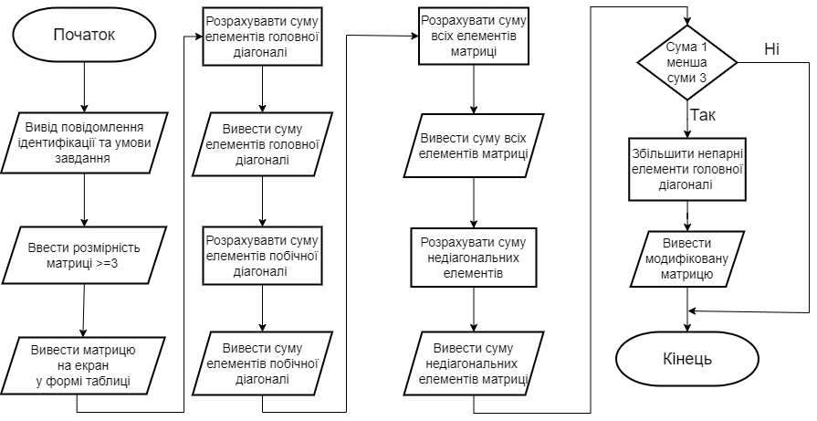
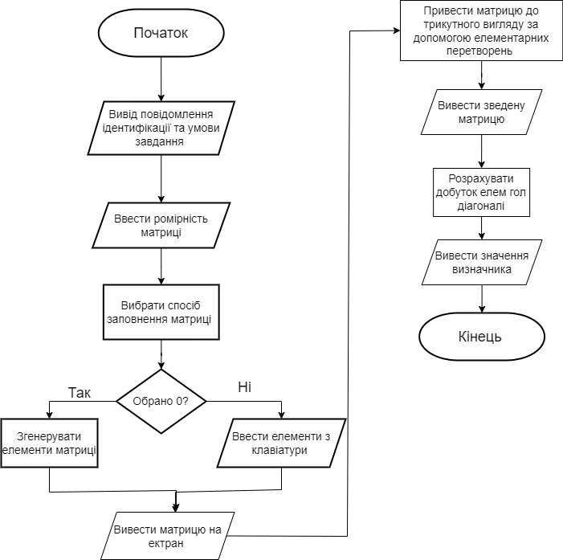

## Мета

- Познайомитися з двовимірними масивами та матрицями. Вивчити способи їх обробки, базові операції над матрицями та їх елементами.

## Умови задач

**Завдання 1:** 
- Створити одновимірний масив цілих чисел, кількість елементів якого ввести з клавіатури. Передбачити меню вибору способу створення масиву: введення з клавіатури або генерація псевдовипадкових чисел. Побудувати новий масив із елементів першого масиву, в якому спочатку стоять числа, що діляться тільки на 2, потім ті, що діляться на 2 та 3, потім ті, що діляться тільки на 3. Надрукувати вхідний та вихідний масиви.

**Завдання 2**
- Створити одновимірний масив, кількість елементів якого ввести з клавіатури. Передбачити меню вибору способу створення масиву: введення з клавіатури або генерація псевдовипадкових чисел. Відсортувати масив за алгоритмом cортування гребінцем(Comb Sort) [1.5] та здійснити пошук в масиві за алгоритмом інтерполяції [2.5]. Передбачити виведення проміжних результатів в процесі виконання ітерацій сортування масиву.

## Блок-схеми

**Завдання 1**: 



**Блок-Схема до завдання 2:**


## Код программ:

```cpp
#include <iostream>
#include <vector>
#include <ctime>
#include <cstdlib>
#include <windows.h>

using namespace std;

// Функція для виводу матриці у вигляді таблиці
void printMatrix(const vector<vector<int> >& matrix) {
    for (int i = 0; i < matrix.size(); i++) {
        for (int j = 0; j < matrix[i].size(); j++) {
            cout << matrix[i][j] << "\t";
        }
        cout << endl;
    }
}

int main() {

    SetConsoleCP(1251);
    SetConsoleOutputCP(1251);

    cout << "Лабораторна робота номер 7, завдання 1, варiант 5" << endl; // вивід повідомлення
    cout << "Студент Старостин Максим Iванович группа IПЗ-12/2" << endl; // вивід повідомлення
    cout << "---------------------Умова завдання---------------------" << endl; // вивід повідомлення
    cout << "Створити квадратну матрицю, розмірність якої n>=3 ввести з клавіатури.\n Передбачити меню вибору способу створення матриці: введення з клавіатури або генерація псевдовипадкових додатніх та від'ємних чисел.\n У створеній квадратній матриці визначити суму всіх елементів матриці, що належать головній діагоналі;\n суму всіх елементів, що належать побічній діагоналі; суму всіх недіагональних елементів матриці;\n кількість нульових елементів матриці. Якщо сума едементів на головній діагоналі менша за суму недіагональних елементів,\n то збільшити кожний елемент головної діагоналі в непарному рядку в 10 разів.\n Вивести на екран вхідгу матрицю у виляді таблиці, шукані суми на головній, побічній дагоналях, недіагональних елементів,\n модифіковану матрицю.", // вивід повідомлення з умовою задачі
        cout << "-----------------------------------------------------------" << endl; // для прикраси

    srand(time(NULL));

    int n;
    cout << "Введіть розмірність квадратної матриці (n >= 3): ";
    cin >> n;

    if (n < 3) {
        cout << "Розмірність матриці повинна бути не менше 3!" << endl;
        return 1;
    }

    vector<vector<int>> matrix(n, vector<int>(n, 0));

    int choice;
    cout << "Оберіть спосіб створення матриці:" << endl;
    cout << "1. Введення з клавіатури" << endl;
    cout << "2. Генерація псевдовипадкових чисел" << endl;
    cin >> choice;

    if (choice == 1) {
        cout << "Введіть матрицю:" << endl;
        for (int i = 0; i < n; i++) {
            for (int j = 0; j < n; j++) {
                cin >> matrix[i][j];
            }
        }
    }
    else if (choice == 2) {
        for (int i = 0; i < n; i++) {
            for (int j = 0; j < n; j++) {
                matrix[i][j] = rand() % 201 - 100; // Генеруємо випадкові числа від -100 до 100
            }
        }
    }
    else {
        cout << "Неправильний вибір!" << endl;
        return 1;
    }

    int mainDiagonalSum = 0;
    int sideDiagonalSum = 0;
    int nonDiagonalSum = 0;
    int zeroCount = 0;

    for (int i = 0; i < n; i++) {
        mainDiagonalSum += matrix[i][i];
        sideDiagonalSum += matrix[i][n - i - 1];
        for (int j = 0; j < n; j++) {
            if (i != j) {
                nonDiagonalSum += matrix[i][j];
            }
            if (matrix[i][j] == 0) {
                zeroCount++;
            }
        }
    }

    cout << "Матриця:" << endl;
    printMatrix(matrix);

    cout << "Сума елементів на головній діагоналі: " << mainDiagonalSum << endl;
    cout << "Сума елементів на побічній діагоналі: " << sideDiagonalSum << endl;
    cout << "Сума недіагональних елементів: " << nonDiagonalSum << endl;
    cout << "Кількість нульових елементів: " << zeroCount << endl;

    if (mainDiagonalSum < nonDiagonalSum) {
        for (int i = 0; i < n; i++) {
            if (i % 2 != 0) {
                matrix[i][i] *= 10;
            }
        }

        cout << "Модифікована матриця:" << endl;
        printMatrix(matrix);
    }

    return 0;
}
```

**Друга программа**
```cpp
#include <iostream>
#include <vector>
#include <windows.h>

using namespace std;

// Функція для виводу матриці у вигляді таблиці
void printMatrix(const vector<vector<double> >& matrix) {
    for (int i = 0; i < matrix.size(); i++) {
        for (int j = 0; j < matrix[i].size(); j++) {
            cout << matrix[i][j] << "\t"; // Виводимо кожен елемент матриці з табуляцією між ними
        }
        cout << endl; // Переходимо на новий рядок після кожного рядка матриці
    }
}

// Функція для обчислення визначника матриці
double determinant(const vector<vector<double> >& matrix) {
    int n = matrix.size();

    // Перевірка, чи матриця є квадратною
    if (n != matrix[0].size()) {
        cout << "Матриця не є квадратною, визначник неможливо обчислити." << endl;
        return 0;
    }

    // Копія матриці для збереження вихідної матриці
    vector<vector<double>> tempMatrix = matrix;

    double det = 1.0;

    for (int i = 0; i < n; i++) {
        // Якщо на головній діагоналі знаходиться нуль, обмінюємо рядки для уникнення ділення на нуль
        if (tempMatrix[i][i] == 0) {
            int swapRow = -1;
            for (int j = i + 1; j < n; j++) {
                if (tempMatrix[j][i] != 0) {
                    swapRow = j;
                    break;
                }
            }
            if (swapRow == -1) {
                cout << "Визначник неможливо обчислити через нуль на головній діагоналі." << endl;
                return 0;
            }
            swap(tempMatrix[i], tempMatrix[swapRow]);
            det *= -1; // Змінюємо знак детермінанта через обмін рядків
        }

        // Зводимо матрицю до трикутного вигляду відносно головної діагоналі
        for (int j = i + 1; j < n; j++) {
            double factor = tempMatrix[j][i] / tempMatrix[i][i];
            for (int k = i; k < n; k++) {
                tempMatrix[j][k] -= factor * tempMatrix[i][k];
            }
        }
        det *= tempMatrix[i][i]; // Обчислюємо визначник за допомогою добутку головної діагоналі
    }

    return det;
}

int main() {


    SetConsoleCP(1251);
    SetConsoleOutputCP(1251);

    cout << "Лабораторна робота номер 7, завдання 2, варiант 5" << endl; // вивід повідомлення
    cout << "Студент Старостин Максим Iванович группа IПЗ-12/2" << endl; // вивід повідомлення
    cout << "---------------------Умова завдання---------------------" << endl; // вивід повідомлення
    cout << "Знайти визначник квадратної матриці. Вимірність матриці n>3 ввести з клавіатури.\n Для вибору способу створення матриці використовувати меню: введення з клавіатури або генерація псевдовипадкових чисел в заданому з клавіатури діапазоні значень.\n Передбачити перевірку, чи є матриця квадратна з виведенням відповідного повідомлення.\n Для визначення визначника матриці використати алгоритм зведення визначника до трикутного вигляду відносно головної діагоналі за допомогою елементарних перетворень матриць.\n Визначник трикутного вигляду відносно головної діагоналі дорівнює добутку елементів головної діагоналі.\n Вивести на екран вхідну матрицю та значення визначника або повідомлення по неможливість розрахунку.", // вивід повідомлення з умовою задачі
    cout << "-----------------------------------------------------------" << endl; // для прикраси


    int n;
    cout << "Введіть розмірність квадратної матриці (n > 3): ";
    cin >> n;

    if (n <= 3) {
        cout << "Розмірність матриці повинна бути більше 3!" << endl;
        return 1;
    }

    vector<vector<double>> matrix(n, vector<double>(n, 0));

    int choice;
    cout << "Оберіть спосіб створення матриці:" << endl;
    cout << "1. Введення з клавіатури" << endl;
    cout << "2. Генерація псевдовипадкових чисел" << endl;
    cin >> choice;

    if (choice == 1) {
        cout << "Введіть матрицю:" << endl;
        for (int i = 0; i < n; i++) {
            for (int j = 0; j < n; j++) {
                cin >> matrix[i][j];
            }
        }
    }
    else if (choice == 2) {
        double minValue, maxValue;
        cout << "Введіть діапазон для генерації псевдовипадкових чисел (мінімальне та максимальне значення): ";
        cin >> minValue >> maxValue;
        for (int i = 0; i < n; i++) {
            for (int j = 0; j < n; j++) {
                matrix[i][j] = (maxValue - minValue) * ((double)rand() / RAND_MAX) + minValue;
            }
        }
    }
    else {
        cout << "Неправильний вибір!" << endl;
        return 1;
    }

    cout << "Вхідна матриця:" << endl;
    printMatrix(matrix);

    double det = determinant(matrix);

    if (det != 0) {
        cout << "Визначник матриці: " << det << endl;
    }

    return 0;
}
```
