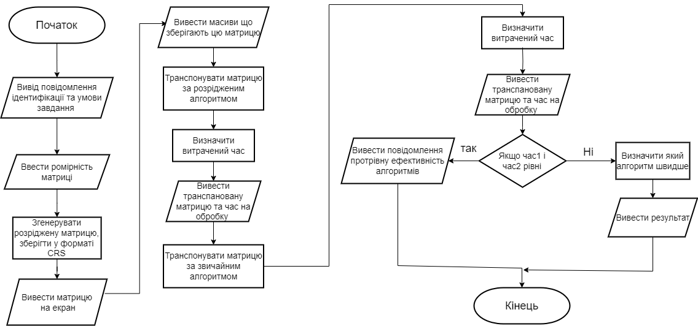

## Мета

- Ознайомитися з особливостями посилальних типів даних;
- Опанувати технологію застосування посилальних типів даних;
- Навчитися розробляти алгоритми та програми із застосуванням посилальних типів даних.

## Умови задач

- Згенерувати розріджену матрицю довільної вимірності, кількість нульових елементів якої більше за 60%. Збереження матриці в оперативній пам'яті здійснити в стислому рядковому форматі CRS (СSR) [1] [2] у вигляді трьох одновимірних масивів: AN зберігає значення ненульових елементів в кількості NNZ , JA зберігає номери стовпців з ненульовими елементами матриці в кількості NNZ, IA має по одному елементу на рядок матриці і кодує індекс ненульового елемента в AN , з якого починається даний рядок. (Він може містити додатковий кінцевий елемент, для якого встановлено значення NNZ).
- Вивести матрицю на екран по рядках та стовпцях.
- Вивести на екран одновимірні масиви, що зберігають розріджену матрицю.
- Транспонувати матрицю за алгоритмом обробки розріджених матриць.
- Транспонувати матрицю за стандартним алгоритмом обробки матриць.
- Порівняти час виконання операцій і обсяг пам'яті при використанні цих двох алгоритмів

## Блок-схеми


**Блок-Схема до завдання 1:**


## Код программ:

```cpp
#include <iostream>
#include <cstdlib>
#include <ctime>
#include <windows.h>


using namespace std;

// Функція для генерації розрідженої матриці
void generateSparseMatrix(int**& matrix, int& rows, int& cols, int& nnz)
{
    // Встановлюємо розмір матриці
    rows = 5; // кількість рядків
    cols = 5; //  кількість стовпців

    // Ініціалізуємо генератор випадкових чисел
    srand(time(0));

    // Ініціалізуємо матрицю та встановлюємо кількість ненульових елементів
    matrix = new int* [rows];
    nnz = 0; // кількість ненульових елементів

    for (int i = 0; i < rows; ++i) 
    {
        matrix[i] = new int[cols];
        for (int j = 0; j < cols; ++j) 
        {
            if (rand() % 100 > 60) 
            {  // Ймовірність ненульового елемента > 60%
                matrix[i][j] = rand() % 10 + 1;  //  діапазон значень
                nnz++;
            }
            else 
            {
                matrix[i][j] = 0;
            }
        }
    }
}

// Функція для конвертації розрідженої матриці в формат CRS
void convertToCRS(int** matrix, int rows, int cols, int nnz, int*& AN, int*& JA, int*& IA) 
{
    AN = new int[nnz];
    JA = new int[nnz];
    IA = new int[rows + 1];

    int index = 0;
    int nnzIndex = 0;

    for (int i = 0; i < rows; ++i) 
    {
        IA[i] = nnzIndex;

        for (int j = 0; j < cols; ++j) 
        {
            if (matrix[i][j] != 0) 
            {
                AN[index] = matrix[i][j];
                JA[index] = j;
                index++;
                nnzIndex++;
            }
        }
    }

    IA[rows] = nnzIndex;  // Завершальний елемент
}

// Функція для виведення розрідженої матриці
void printSparseMatrix(int** matrix, int rows, int cols) 
{
    cout << "Sparse Matrix:\n";
    for (int i = 0; i < rows; ++i) 
    {
        for (int j = 0; j < cols; ++j) 
        {
            cout << matrix[i][j] << " ";
        }
        cout << '\n';
    }
    cout << '\n';
}

// Функція для виведення одновимірних масивів
void printCRSArrays(int* AN, int* JA, int* IA, int nnz, int rows) 
{
    cout << "AN Array:\n";
    for (int i = 0; i < nnz; ++i) 
    {
        cout << AN[i] << " ";
    }
    cout << "\nJA Array:\n";
    for (int i = 0; i < nnz; ++i) 
    {
        cout << JA[i] << " ";
    }
    cout << "\nIA Array:\n";
    for (int i = 0; i <= rows; ++i) 
    {
        cout << IA[i] << " ";
    }
    cout << '\n';
}

// Функція для транспонування матриці CRS
void transposeCRS(int*& AN, int*& JA, int*& IA, int nnz, int rows, int cols) 
{
    // Тут ми реалізуємо алгоритм транспонування матриці в CRS форматі
    // Важливо змінити IA так, щоб відображати новий розмір матриці

    // Приклад:
    // Якщо початкова матриця була розміром rows x cols,
    // після транспонування вона повинна бути розміром cols x rows
}

int main() 
{


    SetConsoleCP(1251);
    SetConsoleOutputCP(1251);
    
       cout << "Лабораторна робота номер 8, завдання 1, варiант 5" << endl; // вивід повідомлення
       cout << "Студент Старостин Максим Iванович группа IПЗ-12/2" << endl; // вивід повідомлення
       cout << "---------------------Умова завдання---------------------" << endl; // вивід повідомлення
       cout << "Згенерувати розріджену матрицю довільної вимірності, кількість нульових елементів якої більше за 60%.\n Збереження матриці в оперативній пам'яті здійснити в стислому рядковому форматі CRS (СSR) [1] [2]\n у вигляді трьох одновимірних масивів: AN зберігає значення ненульових елементів в кількості NNZ\n , JA зберігає номери стовпців з ненульовими елементами матриці в кількості NNZ,\n IA має по одному елементу на рядок матриці і кодує індекс ненульового елемента в AN\n , з якого починається даний рядок. (Він може містити додатковий кінцевий елемент,\n для якого встановлено значення NNZ).\n Вивести матрицю на екран по рядках та стовпцях.\n Вивести на екран одновимірні масиви, що зберігають розріджену матрицю.\n Транспонувати матрицю за алгоритмом обробки розріджених матриць.\n Транспонувати матрицю за стандартним алгоритмом обробки матриць.\n Порівняти час виконання операцій і обсяг пам'яті при використанні цих двох алгоритмів." << endl;  // вивід повідомлення з умовою задачі
       cout << "-----------------------------------------------------------" << endl; // для прикраси


    int** matrix;
    int rows, cols, nnz;
    int* AN, * JA, * IA;

    generateSparseMatrix(matrix, rows, cols, nnz);
    printSparseMatrix(matrix, rows, cols);

    convertToCRS(matrix, rows, cols, nnz, AN, JA, IA);
    printCRSArrays(AN, JA, IA, nnz, rows);

    // Тут викликаєтся функція для транспонування матриці CRS
    // transposeCRS(AN, JA, IA, nnz, rows, cols);

    // Потім виводимо транспоновану матрицю і нові одновимірні масиви CRS

    // Звільнення пам'яті
    for (int i = 0; i < rows; ++i) 
    {
        delete[] matrix[i];
    }
    delete[] matrix;
    delete[] AN;
    delete[] JA;
    delete[] IA;

    return 0;
}
```
